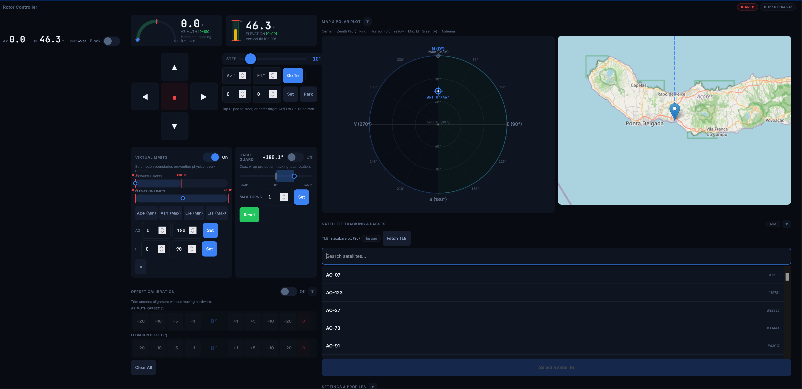

# Rotor Virtual Limit Switch


-brightgreen?style=for-the-badge)


A transparent TCP proxy and Web UI control server that sits between satellite tracking software (e.g., Gpredict, SatPC32, SDR#) and `rotctld` ([Hamlib](https://hamlib.github.io/)) to enforce virtual azimuth/elevation limit switches, a cable tangling guard, position calibration offsets, satellite tracking, and remote command kill-switches.

Designed for responsive touchscreens, mobile devices, and desktop browsers alike.



> [!IMPORTANT]
> **Tested Hardware & System Compatibility**
> 
> This project was developed and hardware-verified using the **[Original AntRunner by Muselab](https://www.tindie.com/products/johnnywu/the-antrunner-rotator/)** coupled with a **Raspberry Pi 3 Model B+**.
> 
> However, because it operates as a standard Hamlib `rotctld` TCP proxy, it is **universally compatible with any antenna rotator system** supported by Hamlib (e.g., Yaesu GS-232, AlfaSpid, PSTRotator, custom Arduino/ESP32 rotators, etc.).

---

## System Architecture

```
                               ┌─────────────────────────────────────────┐
                               │           Web UI Browser                │
                               │           (HTTP Port 8080)              │
                               └────────────────────┬────────────────────┘
                                                    │ REST API
                                                    ▼
┌─────────────────────────┐     TCP Net       ┌───────────────────────────┐     TCP Net       ┌─────────────────────────┐
│   Tracking Software     │   Hamlib Proto    │  Rotor Limit Switch Proxy │   Hamlib Proto    │     hamlib rotctld      │
│  (Gpredict / SatPC32)   ├──────────────────►│        (Port 4534)        ├──────────────────►│       (Port 4533)       │
└─────────────────────────┘                   └─────────────┬─────────────┘                   └────────────┬────────────┘
                                                            │                                              │ Serial / USB
                                                            │ Pure Python SGP4                             ▼
                                                            ▼ Propagator                       ┌─────────────────────────┐
                                              ┌───────────────────────────┐                    │     Hardware Rotator    │
                                              │  Celestrak TLE Satellite  │                    │    (AntRunner / Yaesu)   │
                                              │      Tracking Engine      │                    └─────────────────────────┘
                                              └───────────────────────────┘
```

---

## Key Features

### 🛡️ Virtual Limit Switches
- Enforce strict min/max boundaries for both **Azimuth** (`0°` to `360°`) and **Elevation** (`0°` to `90°`).
- Inbound movement commands outside the permitted boundary range are immediately intercepted and rejected.
- Supports **1-Click Capture**: capture current physical rotor coordinates as Left, Right, Up, or Down limit thresholds with a single button press.

### 🔄 Cable Tangling Guard
- Tracks total accumulated rotation over multiple full turns (360° overlaps).
- Automatically blocks further rotation once a user-configured limit (e.g. 1.0, 1.5, or 2.0 turns) is reached, preventing coaxial cable damage.
- Features a visual net rotation progress bar and 1-click counter reset.

### 🚫 Command Blocking (Kill-Switch)
- Toggle to instantly reject all remote TCP commands from external tracking software while keeping full manual control accessible from the local Web UI.
- Useful for maintenance, manual overrides, or preventing automated passes from interrupting local operations.

### 🎯 Calibration Offsets
- Software-based Azimuth and Elevation calibration offsets.
- Adjust for physical installation misalignment, sensor drift, or offset mountings without needing to re-calibrate physical hardware.

### 🛰️ Integrated Satellite Tracker (Pure Python SGP4)
- **Zero External Dependencies**: Built entirely using Python standard library mathematics (`math`, `datetime`, `urllib`).
- **Celestrak Integration**: Automatically fetches and caches TLE orbital data from Celestrak groups (Weather, Amateur, ISS, CubeSats, Special Interest, or custom URLs).
- **Pass Prediction**: Calculates upcoming satellite passes including AOS (Acquisition of Signal), LOS (Loss of Signal), and Peak/Max Elevation angles.
- **Auto-Steering Engine**: Enables continuous auto-tracking of selected satellites with configurable interval updates.

### 🕹️ Interactive Manual Control & Park
- Full directional control via touch-friendly D-pad (Up/Down/Left/Right) with configurable step movement (° per press).
- Direct **Goto** target azimuth/elevation entry.
- Instant **Stop** command execution.
- Configurable **Park Position**: save and recall custom home/park coordinates with a single click.

### 🗺️ Live Leaflet Map & Location
- Interactive map rendering station coordinates, live azimuth pointer line, satellite ground tracks, and coverage footprints.
- Save ground station latitude, longitude, and elevation to profile.

### 💾 Profile Management
- Create, load, and delete named configuration profiles (e.g. "Portable Ops", "Home Station", "Low-Profile Satellite").
- Save limits, cable guard states, station location, park coordinates, calibration offsets, and backend settings.

### 🔌 Tri-State Backend Health Monitor
- Live connection state tracking of the backend `rotctld` server (Connected / Disconnected / Unreachable).
- Connectivity test utility and one-click reconnect action.

---

## Quick Start

### 1. Prerequisites

- **Python 3.12+** (Uses standard library only — no `pip install` required).
- A running `rotctld` instance connected to your rotator hardware (or `--mock` mode for software testing).

### 2. Basic Running

```bash
# Clone repository
git clone https://github.com/nfacha/RotorVirtualLimit.git
cd RotorVirtualLimit

# Start hamlib rotctld (Example: AntRunner / Yaesu GS-232 on /dev/ttyUSB0)
rotctld -m 1 -r /dev/ttyUSB0 -s 9600 -C serial_speed=9600

# Launch proxy and Web UI
python proxy.py

# Open web interface in your browser
firefox http://localhost:8080
```

---

## Command-Line Options

Launch `proxy.py` with custom flags:

```bash
python proxy.py [OPTIONS]
```

| Flag | Default | Description |
|------|---------|-------------|
| `--listen-port` | `4534` | TCP port where proxy listens for hamlib client connections |
| `--backend` | `127.0.0.1:4533` | Host and port of the upstream `rotctld` daemon |
| `--http-port` | `8080` | Port for the HTTP Web UI server |
| `--config` | `virtual_limits.json` | Path to persistent configuration file |
| `--disabled` | `False` | Start with virtual limits disabled |
| `--cable-guard` | `False` | Start with cable guard enabled |

---

## Running as a Service on Raspberry Pi

To ensure your rotator controller starts automatically on boot, set up `systemd` services on your Raspberry Pi:

### 1. Install System Dependencies

```bash
sudo apt update
sudo apt install -y python3 python3-venv hamlib-utils
```

### 2. Set Up Application Directory

```bash
sudo mkdir -p /opt/rotor-limit-switch
sudo chown -R pi:pi /opt/rotor-limit-switch
git clone https://github.com/nfacha/RotorVirtualLimit.git /opt/rotor-limit-switch
```

### 3. Create Systemd Service for `rotctld`

Create `/etc/systemd/system/rotctld.service`:

```ini
[Unit]
Description=Hamlib rotctld Daemon
After=network.target

[Service]
Type=simple
User=pi
ExecStart=/usr/bin/rotctld -m 1 -r /dev/ttyUSB0 -s 9600 -C serial_speed=9600
Restart=always
RestartSec=5

[Install]
WantedBy=multi-user.target
```

### 4. Create Systemd Service for `rotor-limit-switch`

Create `/etc/systemd/system/rotor-limit-switch.service`:

```ini
[Unit]
Description=Rotor Virtual Limit Switch Proxy and Web UI
After=network.target rotctld.service
Wants=rotctld.service

[Service]
Type=simple
User=pi
WorkingDirectory=/opt/rotor-limit-switch
ExecStart=/usr/bin/python3 /opt/rotor-limit-switch/proxy.py \
    --backend 127.0.0.1:4533 \
    --listen-port 4534 \
    --http-port 8080 \
    --config /opt/rotor-limit-switch/virtual_limits.json
Restart=always
RestartSec=5

[Install]
WantedBy=multi-user.target
```

### 5. Enable and Start Services

```bash
sudo systemctl daemon-reload
sudo systemctl enable rotctld rotor-limit-switch
sudo systemctl start rotctld rotor-limit-switch

# Verify status
sudo systemctl status rotor-limit-switch
```

---

## REST API Reference

All API endpoints return standard JSON responses. POST payloads must be formatted as `Content-Type: application/json`.

### System Status

| Endpoint | Method | Payload | Description |
|----------|--------|---------|-------------|
| `/api/status` | `GET` | — | Returns comprehensive proxy state: position, limits, cable guard, backend reachability, park position, satellite tracking status, and command block state. |

### Virtual Limits

| Endpoint | Method | Payload | Description |
|----------|--------|---------|-------------|
| `/api/limits/manual` | `POST` | `{"az_min": float, "az_max": float, "el_min": float, "el_max": float}` | Explicitly set min/max limit bounds |
| `/api/limits/set-left` | `POST` | — | Capture current Azimuth as `az_min` |
| `/api/limits/set-right` | `POST` | — | Capture current Azimuth as `az_max` |
| `/api/limits/set-down` | `POST` | — | Capture current Elevation as `el_min` |
| `/api/limits/set-up` | `POST` | — | Capture current Elevation as `el_max` |
| `/api/limits/enable` | `POST` | — | Enable virtual limit switch enforcement |
| `/api/limits/disable` | `POST` | — | Disable virtual limit switch enforcement |
| `/api/limits/clear` | `POST` | — | Reset all limit values to unconstrained |

### Cable Tangling Guard

| Endpoint | Method | Payload | Description |
|----------|--------|---------|-------------|
| `/api/cable-guard/enable` | `POST` | — | Enable cable tangling guard |
| `/api/cable-guard/disable` | `POST` | — | Disable cable tangling guard |
| `/api/cable-guard/reset` | `POST` | — | Reset accumulated net rotation counter to 0 |
| `/api/cable-guard/max-turns` | `POST` | `{"turns": float}` | Set maximum allowed turn threshold (e.g. `1.5`) |

### Manual Rotor Movement & Park

| Endpoint | Method | Payload | Description |
|----------|--------|---------|-------------|
| `/api/rotor/goto` | `POST` | `{"az": float, "el": float}` | Command rotor to target Azimuth/Elevation |
| `/api/rotor/move` | `POST` | `{"direction": int, "speed": float}` | Step rotor (`2`=Up, `4`=Down, `8`=Left, `16`=Right) |
| `/api/rotor/stop` | `POST` | — | Issue emergency stop command |
| `/api/rotor/park` | `POST` | — | Command rotor to configured park position |
| `/api/rotor/park-position` | `GET` | — | Get saved park position coordinates |
| `/api/rotor/park-position` | `POST` | `{"az": float, "el": float}` | Save park position coordinates |

### Offsets & Calibration

| Endpoint | Method | Payload | Description |
|----------|--------|---------|-------------|
| `/api/offset/set` | `POST` | `{"az_offset": float, "el_offset": float}` | Set software calibration offset values |
| `/api/offset/clear` | `POST` | — | Reset calibration offsets to 0 |
| `/api/offset/enable` | `POST` | — | Enable software calibration offset application |
| `/api/offset/disable` | `POST` | — | Disable software calibration offset application |

### Satellite Tracker

| Endpoint | Method | Payload | Description |
|----------|--------|---------|-------------|
| `/api/tracking/fetch` | `POST` | `{"source": string}` | Trigger TLE update from Celestrak / custom URL |
| `/api/tracking/satellites` | `POST` | `{"query": string}` | Search available satellites in TLE cache |
| `/api/tracking/passes` | `POST` | `{"satellite": string, "hours": int}` | Predict upcoming passes for a satellite |
| `/api/tracking/start` | `POST` | `{"satellite": string, "auto_steer": bool}` | Begin tracking a satellite |
| `/api/tracking/stop` | `POST` | — | Stop satellite tracking |
| `/api/tracking/status` | `GET` | `?extra=1` | Get current tracking state, target position, and pass details |
| `/api/tracking/sources` | `GET` | — | List available TLE sources and satellite counts |

### Command Blocking & Settings

| Endpoint | Method | Payload | Description |
|----------|--------|---------|-------------|
| `/api/commands/block` | `POST` | — | Block external TCP client commands |
| `/api/commands/unblock` | `POST` | — | Allow external TCP client commands |
| `/api/refresh-interval` | `POST` | `{"ms": int}` | Set Web UI refresh poll interval (min `200` ms) |
| `/api/location` | `GET` | — | Get saved ground station latitude/longitude |
| `/api/location` | `POST` | `{"latitude": float, "longitude": float}` | Set ground station latitude/longitude |

### Backend Configuration

| Endpoint | Method | Payload | Description |
|----------|--------|---------|-------------|
| `/api/backend/config` | `POST` | `{"host": string, "port": int}` | Update target `rotctld` backend address |
| `/api/backend/reconnect` | `POST` | — | Force immediate backend socket reconnection |
| `/api/backend/test` | `POST` | `{"host": string, "port": int}` | Test reachability and query position from backend |

### Profiles

| Endpoint | Method | Payload | Description |
|----------|--------|---------|-------------|
| `/api/profiles/list` | `POST` | — | List all saved configuration profile names |
| `/api/profiles/save` | `POST` | `{"name": string, "description": string}` | Save current configuration as a named profile |
| `/api/profiles/load` | `POST` | `{"name": string}` | Load configuration from a profile |
| `/api/profiles/delete` | `POST` | `{"name": string}` | Delete a saved profile |

---

## Configuration Files

The proxy automatically maintains state across restarts:
- **`virtual_limits.json`**: Primary runtime configuration file storing limits, cable guard counters, offsets, park coordinates, location, and backend configuration.
- **`tle_cache.json`**: Cached TLE orbital data downloaded from Celestrak.
- **`profiles/*.json`**: Individual named profile presets saved by the user.

---

## Development & Mock Testing

A comprehensive test suite is included in `test_proxy.py`. You can run full integration tests without physical hardware attached:

```bash
# Run tests against simulated rotctld mock backend
python test_proxy.py --mock
```

To test against live hardware or a running `rotctld` daemon:

```bash
python test_proxy.py
```

---

## License

This project is licensed under the **GNU Affero General Public License v3.0 (AGPL-3.0)**. See the [LICENSE](LICENSE) file for details.
